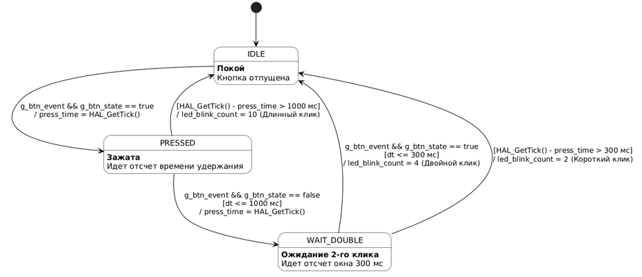
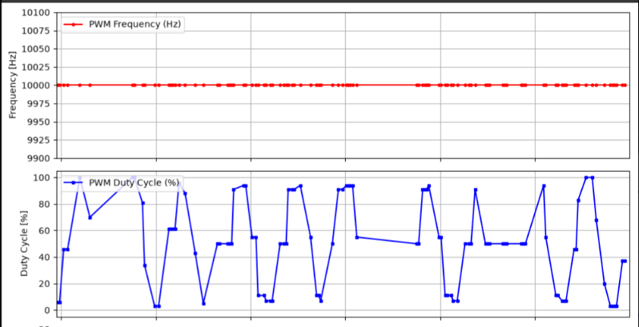
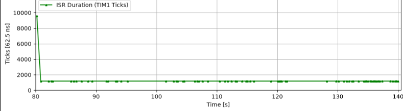
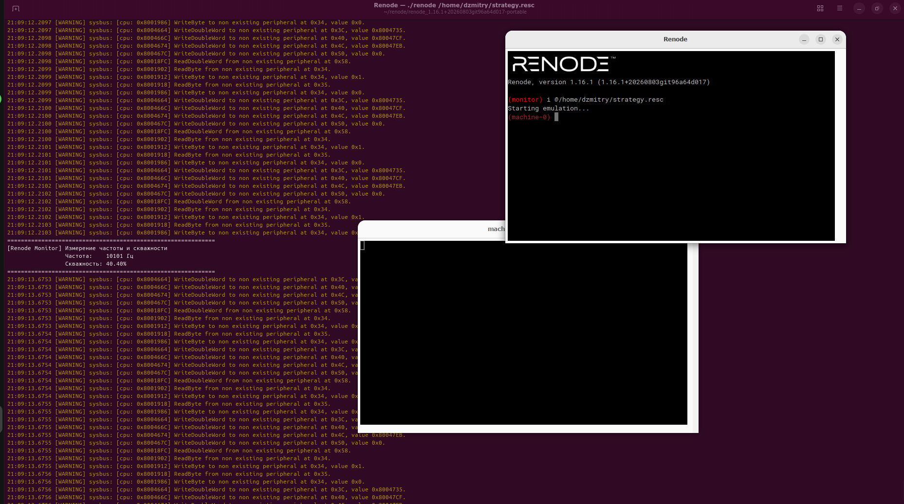
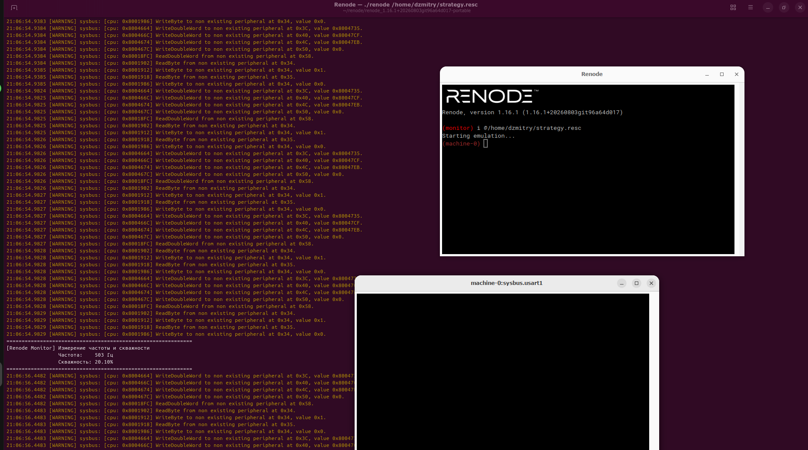
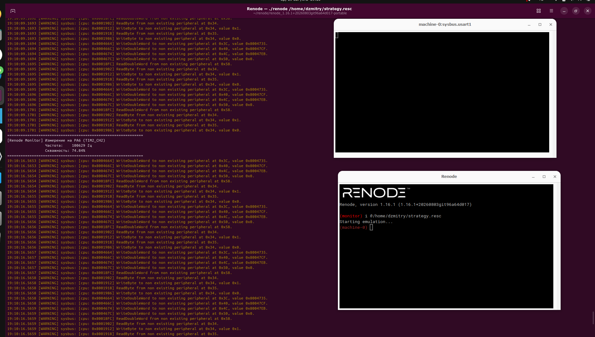
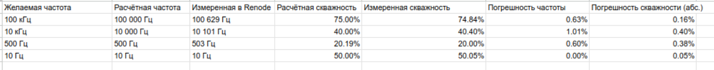

## 🤝 Contributors

Автор:

<table>
  <tr>
    <td align="center">
      <a href="https://github.com/Dzmitry-kulik">
        <br />
        <sub><b>Dzmitry Kulik</b></sub>
      </a><br />
      💻 📖
    </td>
  </tr>
</table>

Ментор:

<table>
  <tr>
    <td align="center">
      <a href="https://github.com/MrDaila007">
        <br />
        <sub><b>Danila Surok</b></sub>
      </a><br />
      💻 📖
    </td>
  </tr>
</table>
# STM32 PWM Configuration

Проект встроенного программного обеспечения для микроконтроллера STM32F4 (Cortex-M4). Прошивка реализует генерацию табличного ШИМ-синуса, двухканальный захват импульсов (Input Capture), профилирование времени выполнения обработчика прерываний (ISR), неблокирующий конечный автомат кнопки и бинарную телеметрию по UART с подтверждением приема (ACK).

Поддерживается сборка через Docker / CMake, а также автоматическое тестирование в симуляторе **Renode** и на физическом железе.

---

## 📌 Ключевой функционал и назначение пинов

* **PA0 (TIM2_CH1):** Выход ШИМ-сигнала с огибающей синусоиды (несущая 100 кГц, синус 1 кГц через DMA).
* **PA1 (TIM2_CH2):** Выход вспомогательного ШИМ-сигнала (100 кГц, скважность 75%).
* **PA6 (TIM3_CH1/CH2):** Двухканальный Input Capture для аппаратного измерения периода и длительности импульса.
* **PB0:** Вход подключения кнопки с внутренней подтяжкой (Pull-Up) и программным антидребезгом (TIM5, 1 мс).
* **PB1:** Отладочный пин профилирования ISR. Переключается в `High` при входе в прерывание TIM5 и в `Low` при выходе.
* **PA8 (TIM1_CH1/CH2):** Захват длительности строба с PB1 для точной оценки времени работы ISR в тактах (62.5 нс).
* **PC13:** Встроенный светодиод для асинхронной индикации режима клика кнопки (1, 2 или 5 вспышек).
* **PB6 (TX) / PB7 (RX):** Интерфейс USART1 (115200 Baud) для передачи структурированной телеметрии на ПК.

---

## 🔌 Схема физических соединений (Перемычки)

Для корректной работы аппаратных измерений необходимо соединить следующие пины на плате проводками:

* **PA0 ↔ PA6:** Подача генерируемого ШИМ-сигнала (`TIM2_CH1`) на вход таймера измерений (`TIM3_CH1/CH2`) для оценки частоты и скважности.
* **PB1 ↔ PA8:** Подача отладочного строба времени работы прерывания (`PB1`) на вход таймера измерений (`TIM1_CH1/CH2`) для профилирования ISR.

---

## 📊 Демонстрация работы

### Схема переходов состояний кнопки
Схема логики обработки нажатий реализована через конечный автомат:


### Графики телеметрии (plotter.py)
Отрисовка в реальном времени профилирования ШИМ и времени ISR через UART:

### График времени нахождения в прерывании


### Аппаратные измерения ШИМ
Примеры захвата частот в различных режимах:
* 
* 
* 
* 

### Таблица синусоиды
Расчетная таблица:


---

## 🛠 Сборка проекта

Сборка прошивки выполняется в изоляции с помощью Docker-контейнера.

1. **Собрать образ и скомпилировать проект:**
```bash
sudo docker build -t pmw-firmware .
